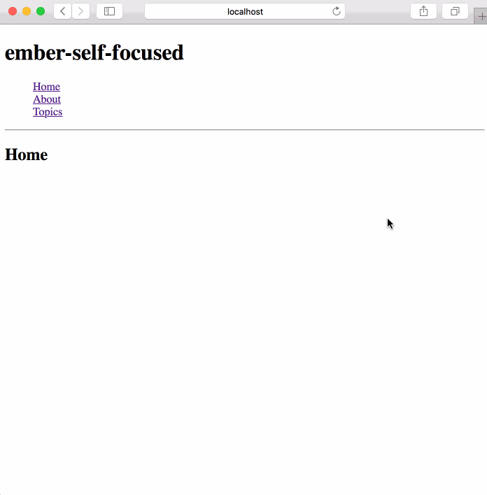

ember-self-focused
==============================================================================

Make an ember application screen reader friendly.

The screen reader reads out the content of a web page on load or page refresh.
In Single Page Application (SPA) there is no page refresh after the initial page load, the UI gets updated without page refresh, which makes it difficult for a screen reader user to be aware of the UI change.
However, if the container of the dynamic content can be focused, the screen reader will start reading out the content of the focused container.

Focusing the content of the dynamic container can be a tedious and repeated job.

For ember applications, this addon solves the problem.



Installation
------------------------------------------------------------------------------

```
ember install ember-self-focused
```

Usage
------------------------------------------------------------------------------

Add the `self-focused` component to all the desired templates/component corresponding to the routes.
```html
{{#self-focused}}
  <!-- html block to be yielded -->
{{/self-focused}}
```
if the `html block to be yielded` is a component and accepting attributes to act upon, the same attribute needs to be passed to the `self-focus` component.
```html
{{#self-focused foo=bar}}
  <!-- {{custom-component foo=bar}} -->
{{/self-focused}}
```

Since the div will be focused, it will have a focus outline/highlight, if that is not desired, please add the following styles:

```css
.self-focused:focus{
  outline: none
}
```

Probably also add the following or similar styles:

```css
// following will serve as a visual hint for currently active link to the sighted users
a.active {
  background: #000000;
  color: #ffffff;
}
// following will serve as a visual hint for currently active link to the sighted users
a.active after{
  content: 'Currently active link.';
  font-size: 0;
}
```

Implementation overview
------------------------------------------------------------------------------

- `self-focused` component
  - on initialization invokes `updateIsFirstRender` method of the `focus-manager` service.
  - on `render` invokes the `setNodeToBeFocused` method of the `focus-manager` service, passing the self HTML node as the argument.
- `focus-manager` service carries out the functionality of focusing the desired node.
  - `focus-manager` utilizes two state variables, namely `isFirstRender` and `nodeToBeFocused`.
    - initial value of the `isFirstRender` is set to `true`
    - initial value of the `nodeToBeFocused` is set to `null`
  - `focus-manager` has two private methods namely `_setFocus` and `_removeTabIndex`.
    - `_setFocus` method
      - adds `tabindex=-1` to the `nodeToBeFocused`
      - invokes native `focus()` method on it
      - attaches `_removeTabIndex` method to the `nodeToBeFocused` as the `click` and `blur` event handler
      - sets `nodeToBeFocused` to `null`
    - `_removeTabIndex` method, removes the `tabindex`, `click` and `blur` event handler from `nodeToBeFocused`
  - `focus-manager` service exposes  two methods, namely `updateIsFirstRender` and `setNodeToBeFocused`, which are consumed by `self-focused` component.
    - `updateIsFirstRender` sets `isFirstRender` to `false` if it is not already.
    - `setNodeToBeFocused` method
      - accepts a HTML node as an argument.
      - verifies the state of `isFirstRender` and if `isFirstRender` is `true`, which is the case for very first invocation, it bails out.
      - if `nodeToBeFocused` is not `null`, it bails out.
      - otherwise, it updates `nodeToBeFocused` with the passed argument, and schedules the private `_setFocus` method, in the `afterRender` queue.

Contributing
------------------------------------------------------------------------------

### Installation

* `git clone <repository-url>`
* `cd ember-self-focused`
* `npm install`

### Running tests

* `ember test` – Runs the test suite on the current Ember version
* `ember test --server` – Runs the test suite in "watch mode"
* `ember try:each` – Runs the test suite against multiple Ember versions

### Running the dummy application

* `ember serve`
* Visit the dummy application at [http://localhost:4200](http://localhost:4200).

License
------------------------------------------------------------------------------

This project is licensed under the [BSD-2-Clause License](LICENSE).
