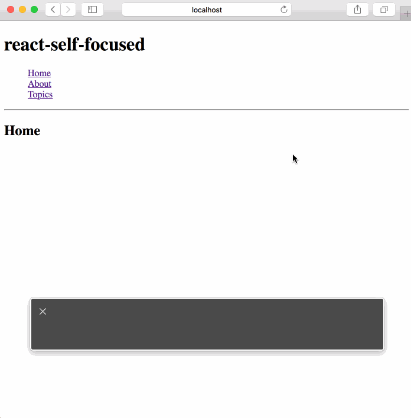

react-self-focused
==============================================================================

Helps make a react (single page) application more friendly to screen readers.

The screen reader reads out the content of a web page on load or page refresh.
In Single Page Application (SPA) there is no page refresh after the initial page load, the UI gets updated without page refresh, which makes it difficult for a screen reader user to be aware of the UI change.
However, if the container of the dynamic content can be focused, the screen reader will start reading out the content of the focused container.

Focusing the content of the dynamic container can be a tedious and repeated job.

For react applications, this component solves the problem.



Installation
------------------------------------------------------------------------------

```
npm i react-self-focused -S
```

Usage
------------------------------------------------------------------------------

Wrap all the routable components by `self-focused`.

```js
import SelfFocused from 'react-self-focused';

<SelfFocused>
  <!-- block to be rendered -->
</SelfFocused>
```

Since the div will be focused, it will have a focus outline/highlight, if that is not desired, please add the following styles:

```css
.self-focused:focus {
  outline: none
}
```

Probably also add the following or similar styles:

```css
Add [`activeClassName="active"`](https://github.com/reactjs/react-router-tutorial/tree/master/lessons/05-active-links#active-class-name) to all the `<Link>` component.

// following will serve as a visual hint for currently active link to the sighted users
a.active {
  background: #000000;
  color: #ffffff;
}
// following will serve as a visual hint for currently active link to the sighted users
a.active after {
  content: 'Currently active link.';
  font-size: 0;
}
```

Implementation overview
------------------------------------------------------------------------------

- `self-focused` component on initial render invokes the `componentDidMount` and on re-render invokes the `componentDidUpdate` method of the `focus-manager` respectively passing the self HTML node as argument .
- `focus-manager` carries out the functionality of focusing the desired node.
  - `focus-manager` utilizes two state variables, namely `isFirstRender` and `nodeToBeFocused`.
    - initial value of the `isFirstRender` is set to `true`
    - initial value of the `nodeToBeFocused` is set to `null`
  - `focus-manager` on initialization schedules `isFirstRender` to be set to `false`in the with `requestAnimationFrame()`.
  - `focus-manager` has two private methods namely `setFocus` and `removeTabIndex`.
    - `setFocus` method
      - adds `tabindex=-1` to the `nodeToBeFocused`
      - invokes native `focus()` method on it
      - attaches `removeTabIndex` method to the `nodeToBeFocused` as the `click` and `blur` event handler
      - sets `nodeToBeFocused` to `null`
    - `removeTabIndex` method, removes the `tabindex`, `click` and `blur` event handlers from `nodeToBeFocused`
  - `focus-manager` exposes two methods, namely `componentDidMount` and `componentDidUpdate`, which are consumed by `self-focused` component.
    - `componentDidMount` and `componentDidUpdate` both accept a HTML node as an argument.
    - `componentDidMount` and `componentDidUpdate` both bail out if `isFirstRender` is true.
    - for `componentDidMount` the very last `self-focused` div passed to it for the render cycle wins
    - for `componentDidUpdate` the very first `self-focused` div passed to `componentDidMount` for the render cycle wins, if and only if `nodeToBeFocused` was null when this method was invoked.
    - `componentDidMount` and `componentDidUpdate` both schedule the private `setFocus` method, in the `afterRender` queue after if `nodeToBeFocused` was updated.

Contributing
------------------------------------------------------------------------------

### Running tests

* `npm t`

### Running the example application

* `npm start`
* Visit the example application at [http://localhost:8080](http://localhost:8080).

License
------------------------------------------------------------------------------

This project is licensed under the [BSD-2-Clause License](LICENSE).
